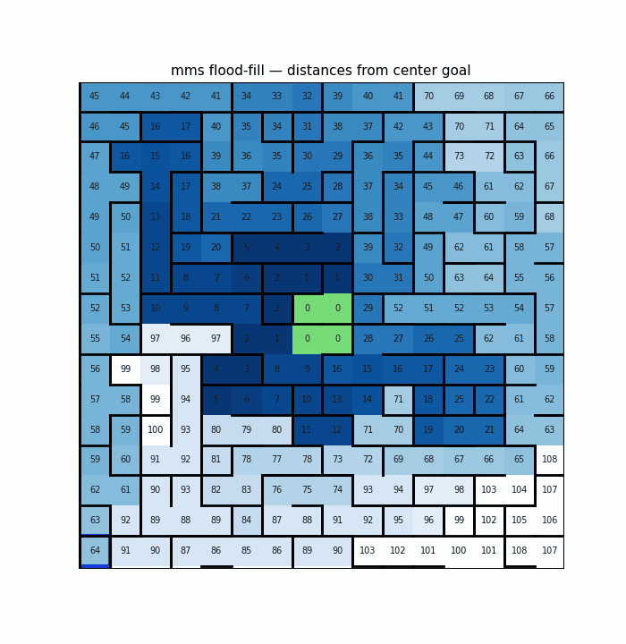
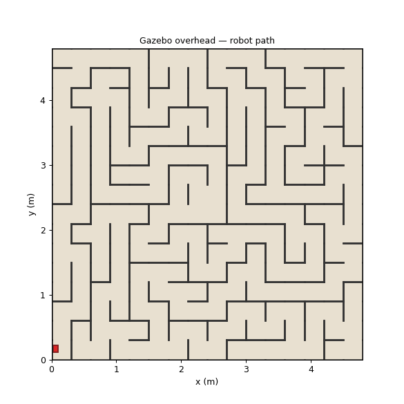

# Micromouse — flood-fill maze solver with lockstep Gazebo mirroring

> A production-style ROS 2 micromouse stack where the **same flood-fill brain** drives the [mackorone/mms](https://github.com/mackorone/mms) GUI and a differential-drive robot in **Gazebo Harmonic**, cell by cell, in real time.

<p align="center">
  
  &nbsp;
  
</p>

<p align="center">
  <a href="#quick-start">Quick start</a> ·
  <a href="#architecture">Architecture</a> ·
  <a href="#demo-recordings">Demos</a> ·
  <a href="#testing">Tests</a> ·
  <a href="docs/DESIGN.md">Design doc</a>
</p>

[](https://docs.ros.org/en/jazzy/)
[](https://gazebosim.org/)
[](https://www.python.org/)
[](LICENSE)

---

## Why this project exists

Classic micromouse implementations weld the solver to a single runtime — you only find out whether the robot reaches the center after a slow, GPU-heavy Gazebo session.

This workspace separates concerns the way competitive micromouse teams do in software:

| Layer | Responsibility | Swappable? |
|-------|----------------|------------|
| **Brain** (`gazebo_sync_brain`) | Flood-fill from center goal, gradient walk, mms protocol | Runs in mms GUI *or* headless host |
| **Maze generator** (`generate_maze`) | Seeded perfect maze → `.num`, JSON spec, Gazebo world | Single source of truth |
| **Motion bridge** (`cell_motion_controller`) | One mms command → one cell move in simulation | Pose-driven, WSL-safe |
| **Live viz** (`brain_viz`) | Distance grid + path trail from ROS topics | Independent window |

The brain speaks the **mms stdin/stdout text protocol** unchanged. A headless host, the real mms AppImage, or the official mms GUI are interchangeable front-ends.

---

## Architecture

```
┌─────────────────────────────────────────────────────────────────┐
│  gazebo_sync_brain  (flood-fill + gradient walk)                │
│  stdout → mms commands   stdin ← ack / maze size                │
└────────────┬───────────────────────────────┬────────────────────┘
             │                               │
    ┌────────▼────────┐              ┌───────▼────────┐
    │  mms GUI        │              │ headless_mms   │
    │  (visual)       │              │ _host.py       │
    └─────────────────┘              └────────────────┘
             │
             │  /maze/mms_command          /maze/current_cell
             ▼                               ▼
    ┌────────────────────┐          ┌─────────────────┐
    │ cell_motion_       │          │ brain_viz       │
    │ controller         │          │ (live path)     │
    │ → Gazebo set_pose  │          └─────────────────┘
    └─────────┬──────────┘
              ▼
       Gazebo Harmonic
       (physical maze walls)
```

**Key design choices**

1. **Full maze knowledge** — The solver reads `maze_spec.json` (walls, goal, cell size). No wall sensing, no re-flooding mid-run; distances are painted once, exactly like the mms screenshot.
2. **Decoupled motion** — The brain fires the entire command queue immediately. The controller drains it one cell at a time via Gazebo `set_pose`, so mms finishes instantly while the robot catches up smoothly.
3. **Pose-driven control** — Skips the fragile ROS↔Gz `/cmd_vel` bridge on WSL/no-GPU setups. Every move is exact with zero odometry drift.
4. **`resetToStart`** — Every mms Run teleports the robot back to `(0,0)` facing North before the solve, so repeated runs are reproducible.

See [docs/DESIGN.md](docs/DESIGN.md) for coordinate conventions, topic contracts, and failure modes.

---

## Quick start

**Prerequisites:** Ubuntu 24.04 + [ROS 2 Jazzy](https://docs.ros.org/en/jazzy/Installation.html), Gazebo Harmonic (`ros-jazzy-ros-gz`), Python 3.12, [mms AppImage](https://github.com/mackorone/mms/releases).

```bash
# Build
cd micromouse_ws
colcon build --symlink-install --packages-select micromouse
source install/setup.bash

# Generate a reproducible 16×16 maze (seed 42)
ros2 run micromouse generate_maze --seed 42 --top-down-cam
```

### Terminal 1 — simulation

```bash
source /opt/ros/jazzy/setup.bash
source install/setup.bash
ros2 launch micromouse maze_gazebo.launch.py steps:=2 step_dt:=0.01
```

Wait ~10 s for the robot to spawn at the bottom-left start cell.

### Terminal 2 — mms GUI

```bash
source /opt/ros/jazzy/setup.bash
source install/setup.bash
~/squashfs-root/AppRun   # mms AppImage
```

In mms: **Maze → Load** `~/.micromouse/maze.num`, set **Mouse → Run command** to:

```bash
bash /path/to/micromouse_ws/src/micromouse/run_brain.sh
```

Click **Run**. The mms mouse and Gazebo robot advance to the center 2×2 together.

> **Habit:** `Ctrl+C` Terminal 1 before each new launch. Never stack two `ros2 launch` sessions.  
> Cleanup one-liner: `pkill -9 -f cell_motion_controller; pkill -9 -f "gz sim"; pkill -9 -f brain_viz; pkill -9 -f gazebo_sync_brain`

> **WSL / no-GPU note:** the Gazebo GUI may print `Failed to load plugin [] … gz_rendering_vendor`
> and show a blank 3D viewport. That is the Ogre render engine, which needs a GPU — it is
> **cosmetic**. The flood-fill brain, the pose-driven motion, and the synthetic overhead
> recordings all run without it (the stack is deliberately pose-driven, not render-driven).
> See [docs/DESIGN.md](docs/DESIGN.md#the-gazebo-3d-viewport-on-wsl--gpu-less-hosts).

---

## Demo recordings

Automated capture (headless mms host + live ROS recorder):

```bash
chmod +x scripts/record_full_session.sh
./scripts/record_full_session.sh --seed 42
```

| Artifact | Description |
|----------|-------------|
| `media/mms_solve.gif` | Offline mms-style flood-fill animation |
| `media/mms_solved.png` | Final distance grid + optimal path |
| `media/brain_path.gif` | Live brain-window trail during Gazebo run |
| `media/gazebo_path.gif` | Top-down world view with robot icon |

Offline render only (no Gazebo):

```bash
python3 scripts/render_solve_gif.py --seed 42 --gif media/mms_solve.gif
```

---

## Repository layout

```
micromouse_ws/
├── src/micromouse/                 # ROS 2 ament_python package
│   ├── micromouse/
│   │   ├── gazebo_sync_brain.py    # BRAIN — mms protocol + ROS bridge
│   │   ├── cell_motion_controller.py
│   │   ├── brain_viz.py            # Live flood-fill + path window
│   │   ├── generate_maze.py        # Maze → .num / spec / .world
│   │   ├── flood_fill.py           # Distance field from center goal
│   │   ├── planner.py              # Gradient descent + turn planner
│   │   └── mms_interface.py        # stdin/stdout mms API wrapper
│   ├── launch/maze_gazebo.launch.py
│   ├── description/micromouse.urdf.xacro
│   └── test/                       # pytest suite
├── scripts/
│   ├── record_full_session.sh      # One-shot demo capture
│   ├── render_solve_gif.py
│   ├── record_session_gifs.py
│   └── headless_mms_host.py
├── docs/DESIGN.md
└── media/                          # Portfolio GIFs
```

---

## Testing

```bash
cd src/micromouse
python3 -m pytest test/ -q
```

Covers maze generation invariants, flood-fill gradient property, mms `.num` round-trip, and planner tie-breaking.

---

## Coordinate conventions

| Concept | Value |
|---------|-------|
| Grid | 16×16, origin bottom-left |
| Start | `(0, 0)` facing **North** (+y) |
| Goal | Center 2×2: `(7,7)…(8,8)` |
| Cell size | 0.30 m (Gazebo) |
| Headings | N=+y, E=+x, S=−y, W=−x |

Aligned with [mackorone/mms](https://github.com/mackorone/mms) and standard micromouse competition layout.

---

## Acknowledgements

- **[mackorone/mms](https://github.com/mackorone/mms)** — Micromouse simulator and Mouse stdin/stdout API.
- **ROS 2 Jazzy + Gazebo Harmonic** — Simulation and middleware stack.

---

Built with flood-fill · the mms protocol · and a robot that does not know it is in a maze until the distances appear.
